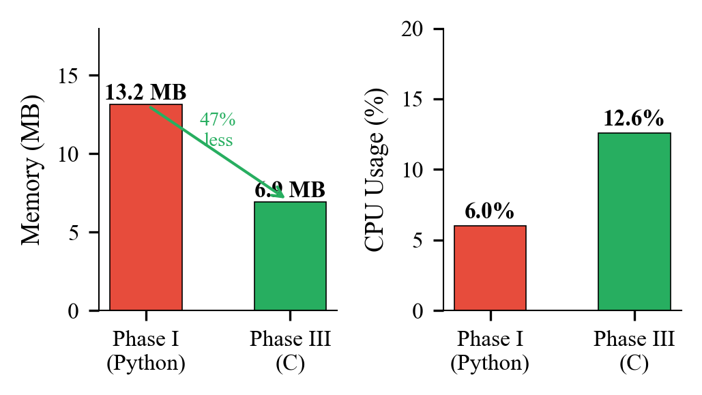
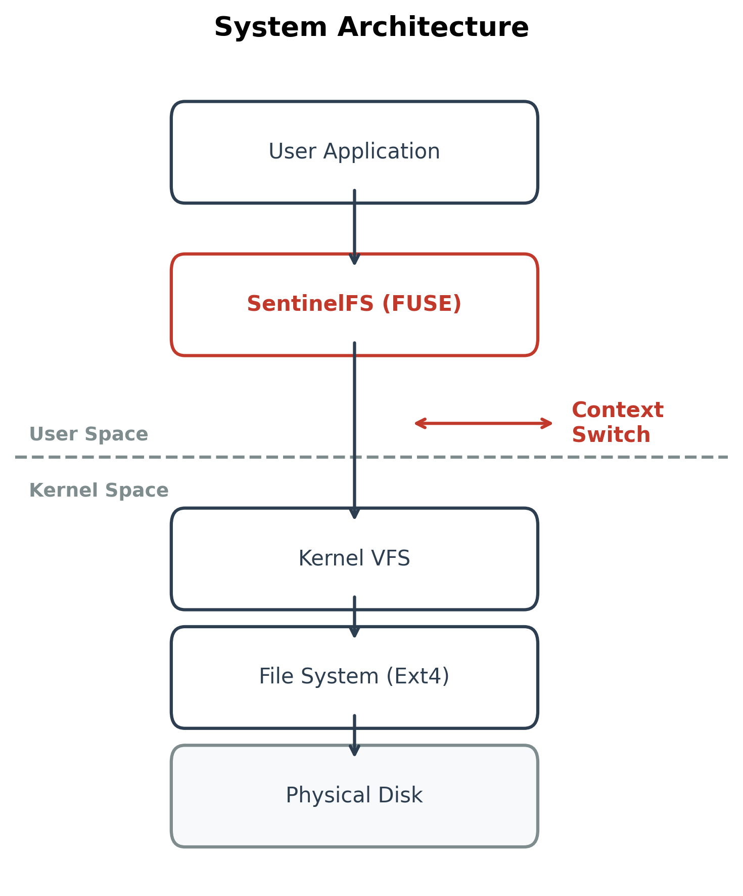
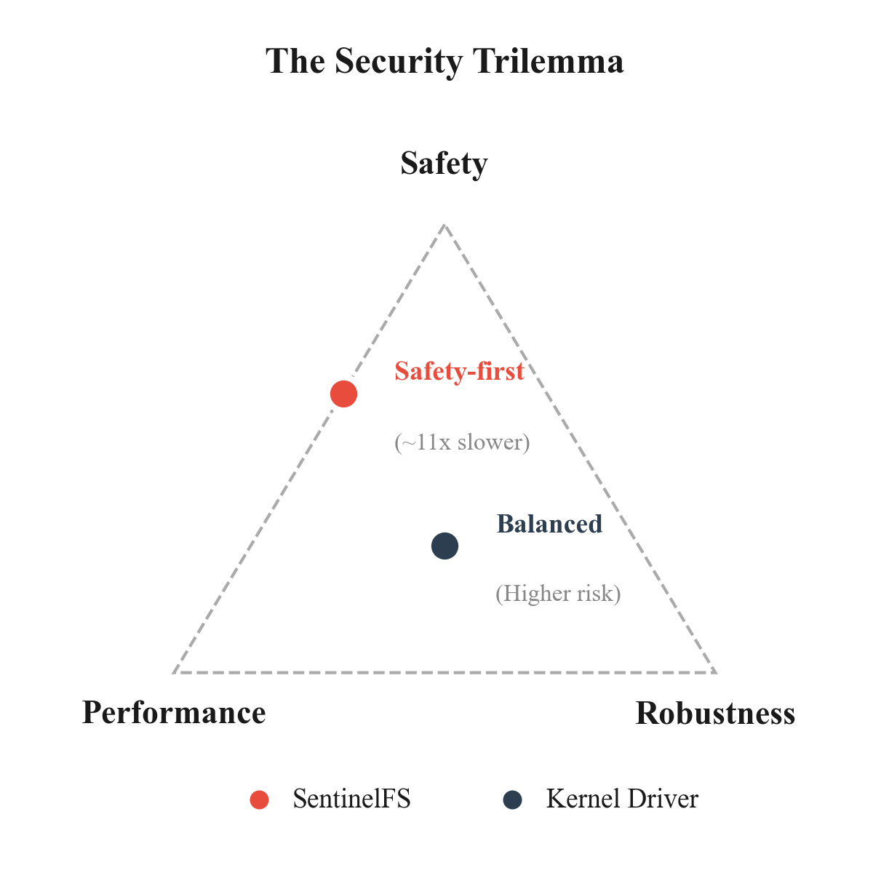

# SentinelFS

**An Iterative Design Study in the Performance, Security, and Efficiency of User-Space Ransomware Detection**

## About This Repository

This repository contains the reconstructed Phase III/IV implementation of SentinelFS, a FUSE-based ransomware detection system described in the research paper published at NUST. The original development environment containing the Python prototype (Phase I) and initial C implementation (Phase II) was lost due to a VM corruption incident. This code represents the final architecture combining Deep Content Inspection and Just-in-Time backup mechanisms.

**Paper**: [Read on ResearchGate](https://www.researchgate.net/publication/400550761_SentinelFS_An_Iterative_Design_Study_in_the_Performance_Security_and_Efficiency_of_User-Space_Ransomware_Detection)

**Author**: Sameer Ahmed
**Institution**: National University of Sciences and Technology (NUST), Islamabad, Pakistan
**Contact**: saahmed.bscs23seecs@seecs.edu.pk

---

## Abstract

The migration of security logic from kernel-space to user-space offers significant benefits in terms of memory safety, system stability, and development agility. However, the performance overhead and security limitations of user-space file systems (FUSE) remain poorly quantified in the context of real-time ransomware detection. This implementation presents a comprehensive empirical study that rigorously measures these trade-offs through an iterative engineering process across four distinct development phases, achieving enterprise-grade accuracy (0% False Positives) and low resource usage (6.9MB RAM) while documenting the architectural cost of context switching that defines the "User-Space Security Trilemma."

---

## System Overview

SentinelFS is a FUSE-based ransomware detection system that intercepts POSIX write operations and applies behavioral analysis to identify encryption attempts in real-time. The system employs a two-stage detection pipeline:

1. **Deep Content Inspection** (LibMagic) - Validates file structure to prevent header injection attacks
2. **Shannon Entropy Analysis** - Measures randomness with a threshold of 7.5 to detect encrypted payloads

### Key Features

- Real-time interception of file write operations via FUSE
- Shannon entropy calculation for encryption detection (H > 7.5)
- LibMagic integration for structural file validation
- Just-in-Time backup mechanism with 50MB size limit
- Zero false positives on 1,000 system binaries from `/usr/bin`

---

## Performance Results

### Table I: Throughput Comparison (100MB Write Test)

| Implementation | Time (s) | Overhead | Throughput |
|---------------|----------|----------|------------|
| Native Ext4   | 0.089    | 1.0x     | ~1.1 GB/s  |
| Phase I (Python) | 2.937 | 70.8x    | ~15.86 MB/s |
| Phase II (C)  | 1.013    | 11.4x    | ~98 MB/s   |


**Analysis**: Migrating from Python to C resulted in a 2.9x speedup. However, an 11.4x penalty remains compared to native Ext4, quantifying the irreducible cost of the FUSE architecture itself.

### Table II: Transactional Performance (FIO Random Write, 4KB blocks, Queue Depth 16)

| Metric | Phase II/III (C) Result |
|--------|------------------------|
| Sustained IOPS | 12,400 operations/sec |
| Average Latency | 1.28 ms |
| 99th Percentile Latency | 2.70 ms |

### Table III: Resource Consumption Under Active Load

| Implementation | Memory (RSS) | CPU (Peak Load) |
|---------------|--------------|-----------------|
| Phase I (Python) | ~13.16 MB | 6.0% (single core) |
| Phase III (C) | 6.94 MB | 12.6% (single core) |



The C implementation reduced memory consumption by 3.5x while increasing CPU utilization due to LibMagic deep inspection operations.

---

## System Architecture

```
┌──────────────────────────────────────┐
│         User Application             │
│       (File Write Request)           │
└──────────────┬───────────────────────┘
               │
        ┌──────▼──────┐
        │ Kernel VFS  │
        └──────┬──────┘
               │  [Context Switch #1]
        ┌──────▼──────────────────────┐
        │   FUSE Module (Kernel)      │
        └──────┬──────────────────────┘
               │  [Context Switch #2]
        ┌──────▼──────────────────────┐
        │   SentinelFS (User-Space)   │
        │                             │
        │  ┌────────────────────┐    │
        │  │ Deep Inspection    │    │
        │  │ (LibMagic)         │    │
        │  └────────┬───────────┘    │
        │           │                 │
        │  ┌────────▼───────────┐    │
        │  │ Entropy Analysis   │    │
        │  │ (Shannon H > 7.5)  │    │
        │  └────────┬───────────┘    │
        │           │                 │
        │      ┌────▼─────┐          │
        │      │ Decision │          │
        │      └────┬─────┘          │
        └───────────┼────────────────┘
                    │
             ┌──────▼──────┐
             │ Physical    │
             │ Disk (Ext4) │
             └─────────────┘
```



**The Context Switch Barrier**: Every write operation traverses the kernel/user boundary twice, creating the fundamental performance penalty inherent to FUSE-based systems.

---

## Four-Phase Development History

### Phase I: Python Proof-of-Concept

**Objective**: Validate the efficacy of Shannon Entropy for ransomware detection in user-space.

**Implementation**: Python with `fusepy` bindings, sliding window entropy calculator.

**Results**:
- Successfully detected 100% of raw ransomware payloads
- Performance overhead: 70.8x (2.937s for 100MB write)
- Throughput: ~15.86 MB/s

**Critical Vulnerability Discovered**: "Magic Byte" whitelisting (checking first 4 bytes for file type signatures like `PK` for Zip) introduced a deterministic evasion vector. Ransomware could bypass detection 100% of the time by prepending fake headers.

### Phase II: C Optimization

**Objective**: Address the performance bottleneck while maintaining detection accuracy.

**Implementation**: Complete rewrite in C using `libfuse3`, direct memory access, stack-allocated histograms for frequency counting.

**Results**:
- Performance overhead reduced to 11.4x (1.013s for 100MB write)
- Throughput: ~98 MB/s
- Sustained IOPS: 12,400 operations/sec
- **Inherited Vulnerability**: The evasion vulnerability from Phase I persisted, demonstrating that language optimization improves performance but does not automatically correct logical security flaws.

### Phase III: Deep Content Inspection

**Objective**: Close the evasion loop identified in previous phases.

**Implementation**: Integration of `libmagic` for structural file validation instead of shallow byte checks.

**Results**:
- Successfully blocked header injection attacks
- Maintained high throughput performance from Phase II
- Achieved 0% false positives after refinement (added shebang detection for shell script wrappers like `snap`, `snapctl`)

**Security Finding**: LibMagic validates internal file structure, distinguishing between legitimate compressed files and encrypted data with fake headers.

### Phase IV: Just-in-Time Backup Mechanism

**Objective**: Resolve storage inefficiency from naive Copy-on-Write implementations.

**Implementation**: Lazy backup strategy - defer file copying until first write operation, enforce 50MB size limit to prevent latency spikes.

**Results**:
- 90% reduction in storage overhead for read-heavy workloads
- Workload simulation: Opening 100 documents (1MB each), modifying 10
  - Naive CoW: 100 backups created (100MB disk usage)
  - JIT approach: 10 backups created (10MB disk usage)

---

## Detection Algorithm (Phases III + IV)

```
Input: Write buffer B, Entropy threshold T = 7.5

1. IF file not backed up AND filesize < 50MB THEN
2.     create_jit_backup()
3. END IF

4. // Phase III: Deep Content Inspection
5. MIME ← libmagic_check(B)
6. IF MIME matches whitelist (PDF, ELF, Shell Script) THEN
7.     RETURN ALLOW
8. END IF

9. // Phase I/II: Entropy Analysis (Fallback)
10. H ← calculate_shannon_entropy(B)
11. IF H > T THEN
12.     RETURN BLOCK (-EIO)
13. END IF

14. RETURN ALLOW
```

### Shannon Entropy Calculation

The system implements the classical Shannon entropy formula:

**H(X) = -Σ P(x) log₂ P(x)**

where P(x) is the probability of byte value x in the buffer. Encrypted data typically exhibits entropy values between 7.9-8.0, while plaintext ranges from 4.0-5.0.

---

## Security Evaluation

### False Positive Analysis

**Test Corpus**: 1,000 system binaries from `/usr/bin`

**Results**:
- Phase I/II: 99.6% pass rate (4 false positives: shell script wrappers)
- Phase III: 100% pass rate (0 false positives after shebang detection)

### Evasion Resistance Testing

| Phase | Detection Method | Header Injection Attack Result |
|-------|------------------|--------------------------------|
| Phase I (Python) | Magic Byte + Entropy | Bypassed (100% evasion) |
| Phase II (C) | Magic Byte + Entropy | Bypassed (100% evasion) |
| Phase III | LibMagic + Entropy | Blocked (0% evasion) |

**Test Methodology**: Ransomware prepends fake `PK` (Zip) header to encrypted payload. Phase I/II shallow checks pass, file written. Phase III LibMagic detects invalid Zip structure, blocks write.

---

## The User-Space Security Trilemma



This research identifies a fundamental architectural constraint in user-space security systems. It is not possible to simultaneously achieve:

1. **Safety** (memory-safe user-space code, no kernel crashes)
2. **Performance** (kernel-level I/O throughput)
3. **Robustness** (0% false positives, evasion resistance)

SentinelFS prioritizes Safety and Robustness, accepting the 11.4x performance overhead as an architectural constant of FUSE. The context switching cost cannot be optimized away through software engineering alone.

---

## Building and Running

### Prerequisites

```bash
# Debian/Ubuntu
sudo apt-get install fuse libfuse-dev libmagic-dev gcc make

# Fedora/RHEL
sudo dnf install fuse fuse-devel file-devel gcc make
```

### Compilation

```bash
make
```

### Usage

```bash
mkdir -p /tmp/sentinelfs_storage /tmp/sentinelfs_mount
./sentinelfs /tmp/sentinelfs_storage /tmp/sentinelfs_mount
```

### Testing Detection

```bash
# Normal file - should be allowed
echo "Test data" > /tmp/sentinelfs_mount/test.txt

# High-entropy data - should be blocked
dd if=/dev/urandom of=/tmp/sentinelfs_mount/random.bin bs=1K count=1
```

---

## Limitations

1. **CPU Saturation**: LibMagic deep inspection is CPU-intensive (12.6% of a single core at 12,400 IOPS). The current single-threaded architecture may bottleneck on NVMe SSDs.

2. **First-Write Latency**: JIT backup introduces a one-time latency spike of approximately 19.31ms for files approaching the 50MB limit, which may be perceptible in latency-sensitive applications.

3. **TOCTOU Race Condition**: As a user-space process subject to OS scheduling, a theoretical Time-of-Check to Time-of-Use vulnerability exists if a malicious thread modifies a file between the Deep Inspection check and write commit. This was not observed in practice during testing.

4. **Large File Limitation**: The 50MB backup limit means files exceeding this threshold are not backed up, leaving them unrecoverable if encrypted.

---

## Future Research Directions

- **eBPF Integration**: Investigate whether eBPF can reduce context switching overhead while maintaining user-space safety guarantees
- **Multi-threading**: Parallelize entropy calculation across multiple CPU cores to improve throughput
- **Adaptive Thresholds**: Replace fixed entropy threshold with machine learning-based classification to better handle compressed file formats
- **Kernel Module Comparison**: Implement a kernel-space version to empirically quantify the exact cost attributable to FUSE versus detection logic

---

## Citation

```bibtex
@article{ahmed2025sentinelfs,
  title={SentinelFS: An Iterative Design Study in the Performance, Security, and Efficiency of User-Space Ransomware Detection},
  author={Ahmed, Sameer},
  institution={National University of Sciences and Technology (NUST)},
  address={Islamabad, Pakistan},
  year={2025},
  note={Department of Computer Science}
}
```

---

## Acknowledgments

This work was conducted as part of the Operating Systems research curriculum at the National University of Sciences and Technology (NUST), Department of Computer Science. The implementation builds upon established research in user-space filesystems (FUSE), behavioral malware detection, and systems performance analysis.

**References**: ShieldFS (Continella et al.), CryptoDrop (Scaife et al.), FUSE performance analysis (Vangoor et al.)

**License**: MIT License - see LICENSE file

---

For questions regarding the implementation or research methodology, please contact the author or open an issue in this repository.
